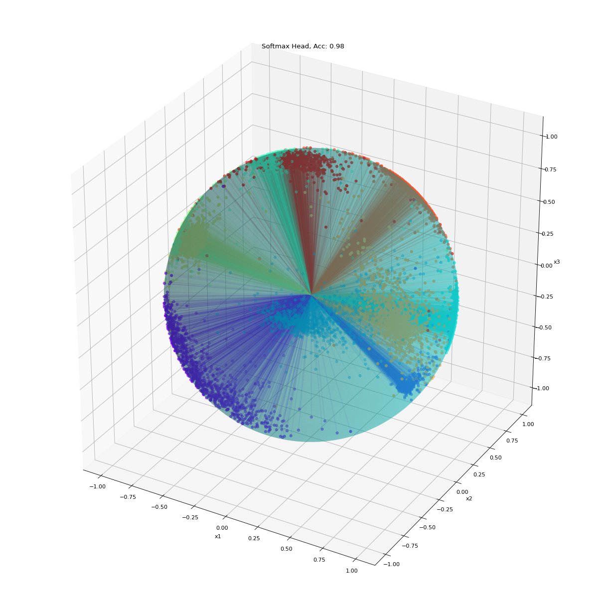
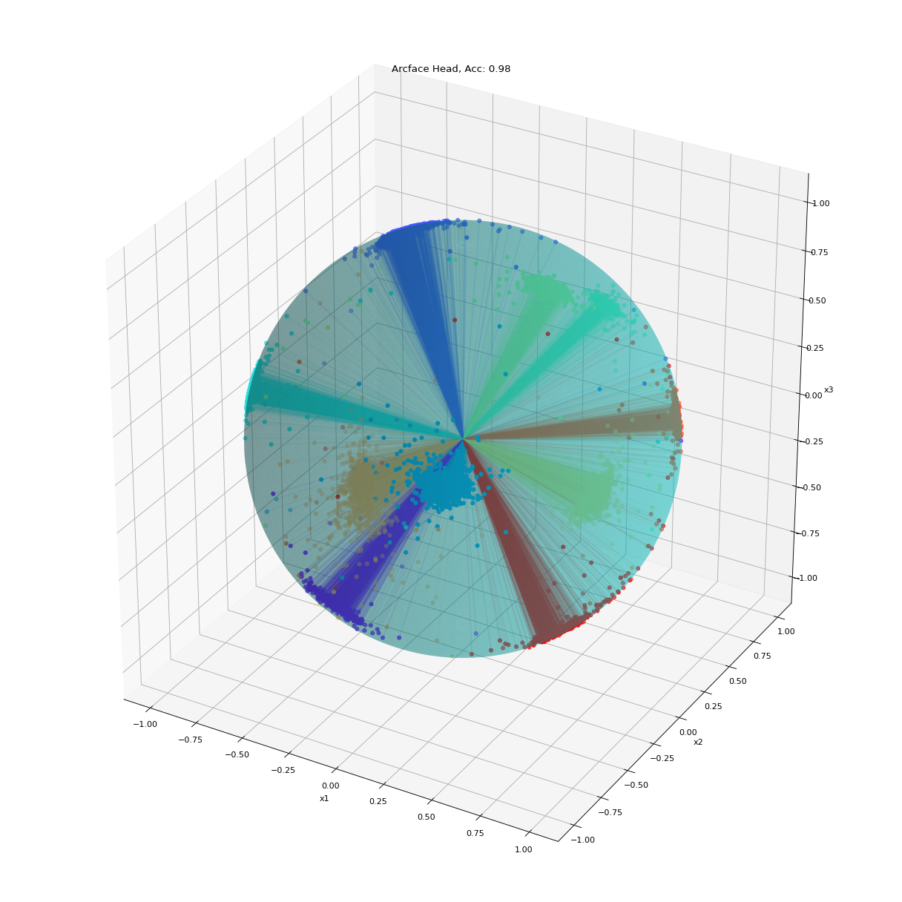
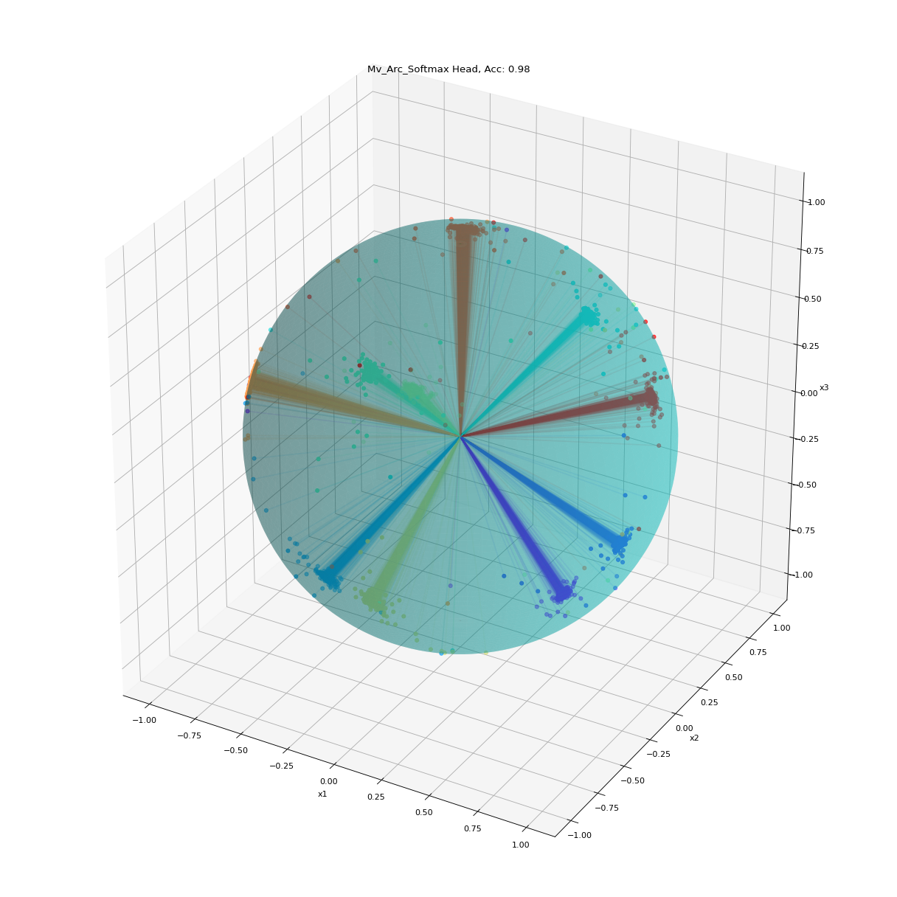
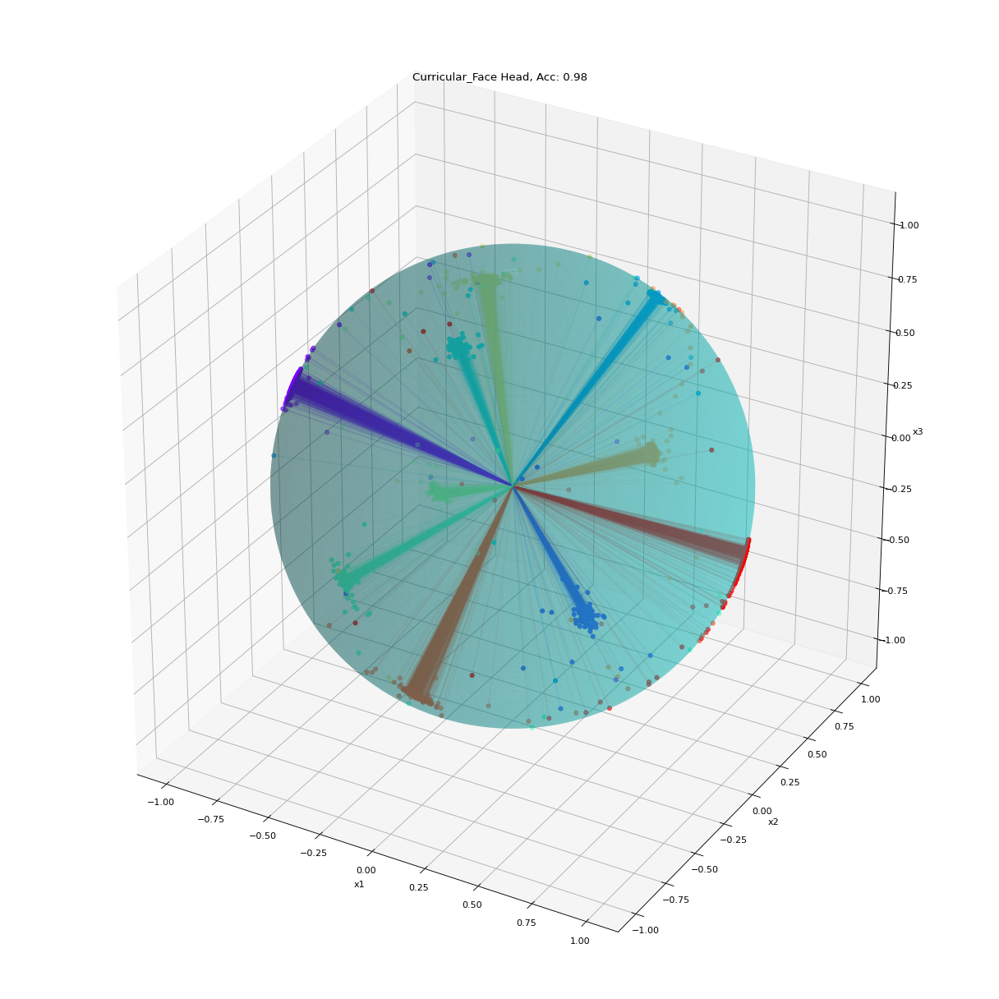

# Angular Margin Losses for Representative Embeddings Training: ArcFace (2018) vs MV-Arc-Softmax (2019) vs CurricularFace (2020)

In [this](https://emkademy.medium.com/angular-margin-losses-for-representative-embeddings-training-arcface-2018-vs-mv-arc-softmax-96b54bcd030b) 
blog post you can find a tutorial/explanations about how *angular margin losses* work in general, and comparison of three powerfull angular
margin based loss functions, namely: [ArcFace](https://arxiv.org/pdf/1801.07698v1.pdf), [MV-Arc-Softmax](https://arxiv.org/pdf/1912.00833.pdf), and [CurricularFace](https://arxiv.org/pdf/2004.00288.pdf)

The notebook is also accessable on Google Colab:

## Softmax

## ArcFace

## MV-Arc-Softmax

## CurricularFace

## TODO

- [ ] Add more explanations to README,
- [ ] Add more comments to the code

